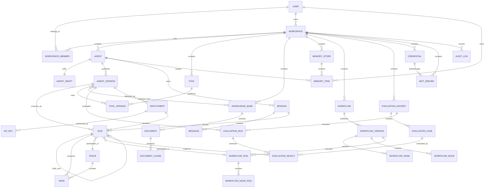

# VibesFactory — Entity Relationship Diagram

**Document Version:** 0.1  
**Status:** Proposed / Source of Truth  
**Companion Document:** DATABASE_SCHEMA.md

---

# 1. Purpose

This document defines the relationships between the core VibesFactory entities.

The ERD emphasizes four architectural concepts:

```text
Tenant Ownership

Configuration Versioning

Execution Lineage

Operational Traceability
```

The most important relationship chain in VibesFactory is:

```text
Agent
  ↓
AgentVersion
  ↓
Deployment / Run / Evaluation
```

Published execution must never depend on mutable agent drafts.

---

# 2. Top-Level Domain Map

```text
Workspace
│
├── Agents
├── Tools
├── MCP Servers
├── Credentials
├── Knowledge Bases
├── Memory Stores
├── Guardrails
├── Workflows
├── Evaluation Datasets
├── Deployments
├── Runs
├── Traces
└── Audit Logs
```

`Workspace` is the principal tenant boundary.

---

# 3. Core ERD



---

# 4. Workspace Ownership

Every major product resource belongs to one Workspace.

```text
Workspace
├── Agent
├── Tool
├── Credential
├── MCP Server
├── Knowledge Base
├── Memory Store
├── Guardrail
├── Workflow
├── Evaluation Dataset
├── Deployment
└── Run
```

Cross-workspace references are prohibited.

Example invalid relationship:

```text
Workspace A Agent
        ↓
Workspace B Tool
```

The application must reject it.

---

# 5. User Membership

```text
User
  │
  └── WorkspaceMember
           │
           ▼
       Workspace
```

A user may belong to multiple workspaces.

A workspace may contain multiple users.

Current roles:

```text
OWNER
MEMBER
```

Future RBAC may expand roles without changing the resource ownership model.

---

# 6. Agent Lifecycle

```text
Agent
  │
  ├── AgentDraft
  │
  │      mutable
  │
  └── AgentVersions
         │
         ├── v1
         ├── v2
         └── v3
              immutable
```

`Agent` represents identity.

`AgentDraft` represents current editable state.

`AgentVersion` represents published runtime state.

---

# 7. Agent Publication Flow

```text
AgentDraft
    │
    │ publish
    ▼
AgentVersion
    │
    ├── Instructions Snapshot
    ├── Model Configuration
    ├── Runtime Configuration
    ├── Memory Configuration
    ├── Tool Version Bindings
    ├── Knowledge Bindings
    ├── Guardrail Version Bindings
    └── Child Agent Bindings
```

Publishing must create a complete runtime snapshot.

---

# 8. Agent Versions and Runs

```text
Agent
 ↓
AgentVersion v4
 ↓
Run
```

A Run must never resolve its instructions from:

```text
AgentDraft
```

after creation.

This ensures:

```text
Run from January
```

can still be explained even if the Agent draft changed in February.

---

# 9. Deployment Relationship

```text
Agent
  │
  └── AgentVersion v3
            │
            ▼
       Deployment
            │
            ▼
           Run
```

Deployment is a movable pointer.

Rollback:

```text
Deployment
   │
   ├── before → v4
   │
   └── after  → v3
```

Agent versions themselves are unchanged.

---

# 10. Session Relationship

```text
Agent
 ↓
Session
 ├── User Message
 ├── Assistant Message
 ├── User Message
 └── Assistant Message
```

A session belongs to logical Agent identity.

Different messages may have been processed by different AgentVersions.

Example:

```text
Session

Turn 1 → Agent v1
Turn 2 → Agent v1

deployment updated

Turn 3 → Agent v2
```

Each Run stores its precise AgentVersion.

---

# 11. Session Is Not Memory

```text
Session
  ↓
Messages
```

represents conversation history.

Long-term memory lives separately:

```text
MemoryStore
  ↓
MemoryItem
```

This distinction must remain explicit.

---

# 12. Memory Relationship

```text
MemoryStore
    │
    ├── User A
    │    ├── PROFILE
    │    ├── SEMANTIC
    │    └── SUMMARY
    │
    └── Agent-level
         └── PROCEDURAL
```

Memory may be scoped by:

```text
Workspace
Memory Store
User
Agent
```

Example:

```text
"User prefers Python"
```

may use:

```text
user_id = user A
agent_id = NULL
```

if shared across agents.

Or:

```text
user_id = user A
agent_id = coding agent
```

if agent-specific.

---

# 13. Tool Lifecycle

```text
Tool
 │
 ├── ToolVersion v1
 ├── ToolVersion v2
 └── ToolVersion v3
```

AgentVersion binds to:

```text
ToolVersion
```

not mutable Tool identity alone.

---

# 14. Agent Tool Relationship

```text
AgentVersion
      │
      ├── Calculator v1
      ├── GitHub Search v3
      └── Weather API v2
```

This relationship is many-to-many:

```text
AgentVersion
   N
   │
   │
   M
ToolVersion
```

implemented through:

```text
agent_version_tools
```

---

# 15. Tool Execution Is Runtime Data

Tool execution does not require a permanent dedicated table in MVP.

Execution is represented by:

```text
Run
 ↓
Span(type=TOOL)
```

The Span captures:

```text
tool_version_id
tool_name
arguments
result
latency
status
```

after redaction.

---

# 16. Credential Relationship

Credentials are resources.

```text
Workspace
   │
   ▼
Credential
   │
   ├── HTTP Tool
   ├── MCP Server
   └── Model Provider
```

Actual credential values must never be copied into:

```text
AgentVersion

ToolVersion configuration

Run

Span

Message
```

These resources hold only credential references.

---

# 17. MCP Relationship

```text
MCPServer
    │
    ├── Tool A
    ├── Tool B
    └── Tool C
```

Remote tools may be cached in:

```text
mcp_tool_catalog
```

A VibesFactory ToolVersion of type:

```text
MCP
```

contains configuration pointing to:

```text
MCPServer
+
remote tool name
```

Runtime then normalizes this to the same `ResolvedTool` abstraction used by other tool types.

---

# 18. Knowledge Model

```text
KnowledgeBase
     │
     ├── Document A
     │     ├── Chunk 1
     │     ├── Chunk 2
     │     └── Chunk 3
     │
     └── Document B
           ├── Chunk 1
           └── Chunk 2
```

`DocumentChunk` owns the embedding.

---

# 19. Agent Knowledge Relationship

```text
AgentVersion
     │
     ├── Knowledge Base A
     └── Knowledge Base B
```

The binding stores retrieval configuration such as:

```text
top_k
metadata filters
score threshold
```

The actual KB contents may continue evolving in MVP.

---

# 20. Retrieval Execution

Runtime relationship:

```text
Run
 ↓
Retrieval Span
 ↓
Document Chunks
```

Historical provenance is stored inside Trace data.

Example:

```text
Run #123 retrieved:
- chunk A
- chunk C
- chunk F
```

This is more useful for debugging than storing only generated citations.

---

# 21. Trace Hierarchy

```text
Trace
│
└── Root Run Span
     │
     ├── Memory Retrieval
     │
     ├── Knowledge Retrieval
     │
     ├── Model Call
     │
     ├── Tool Call
     │
     ├── Child Agent
     │   └── ...
     │
     └── Model Call
```

Hierarchical structure uses:

```text
parent_span_id
```

---

# 22. Run Hierarchy

Multi-agent execution uses separate Runs.

```text
Run: Supervisor
│
├── Run: Research Agent
│
└── Run: Writer Agent
```

Relationships:

```text
Supervisor:
parent_run_id = NULL
root_run_id = supervisor.id

Research:
parent_run_id = supervisor.id
root_run_id = supervisor.id

Writer:
parent_run_id = supervisor.id
root_run_id = supervisor.id
```

---

# 23. Why Child Agents Need Separate Runs

Separate Runs preserve independent:

```text
AgentVersion
Token Usage
Latency
Errors
Cost
Trace Context
Evaluation Data
```

A child agent should not merely appear as a generic Tool Span with no Run identity.

---

# 24. Workflow Model

```text
Workflow
   │
   └── WorkflowVersion
           │
           ├── Nodes
           └── Edges
```

Workflow identity is mutable.

Published WorkflowVersion is immutable.

---

# 25. Workflow Graph

Example:

```text
START
  │
  ▼
Research Agent
  │
  ▼
Condition
 ┌┴────────────┐
 │             │
 ▼             ▼
Writer       Search Tool
 │             │
 └──────┬──────┘
        ▼
       END
```

Graph structure belongs to:

```text
WorkflowVersion
```

not Workflow identity.

---

# 26. Workflow Runtime

```text
WorkflowVersion
       │
       ▼
WorkflowRun
       │
       ├── WorkflowNodeRun
       ├── WorkflowNodeRun
       └── WorkflowNodeRun
```

Every node execution persists independently.

---

# 27. Workflow Agent Node

When a workflow executes an Agent node:

```text
WorkflowNodeRun
       │
       ▼
      Run
```

The corresponding Run stores:

```text
workflow_run_id
```

and the WorkflowNodeRun stores:

```text
agent_run_id
```

This creates direct debug navigation.

---

# 28. Workflow Is Not Agent Memory

Workflow state:

```text
variables
completed nodes
current node
waiting state
```

belongs to:

```text
WorkflowRun
```

not:

```text
MemoryItem
```

and not:

```text
Session
```

---

# 29. Approval Relationship

Approval can suspend either:

```text
Agent Tool Action
```

or:

```text
Workflow Approval Node
```

Therefore:

```text
ApprovalRequest
├── run_id nullable
├── workflow_run_id nullable
└── workflow_node_run_id nullable
```

At least one execution relationship must identify the blocked action.

---

# 30. Approval Resume Flow

```text
Tool Request
    │
    ▼
Guardrail
    │
    ▼
ApprovalRequest
    │
    ▼
Run = WAITING_APPROVAL
    │
 Human decision
    │
    ▼
ApprovalRequest = APPROVED
    │
    ▼
Execute persisted exact action
```

No new LLM decision is needed before executing the approved action.

---

# 31. Evaluation Model

```text
EvaluationDataset
       │
       ├── Case 1
       ├── Case 2
       └── Case 3
```

An EvaluationRun combines:

```text
Dataset
+
AgentVersion
```

---

# 32. Evaluation Execution Relationship

```text
EvaluationRun
       │
       ├── Evaluation Case
       │       │
       │       ▼
       │      Run
       │       │
       │       ▼
       │  EvaluationResult
       │
       └── ...
```

The ordinary Runtime executes every case.

---

# 33. Why EvaluationResult References Run

Without `run_id`, an evaluation score such as:

```text
Groundedness = 0.42
```

is difficult to debug.

With the relationship:

```text
EvaluationResult
      ↓
Run
      ↓
Trace
```

the developer can inspect:

```text
retrieved chunks
model calls
tool calls
memory
errors
```

that produced the score.

---

# 34. Evaluation Version Comparison

```text
Dataset X
  │
  ├── AgentVersion v1
  │       ↓
  │   EvaluationRun A
  │
  └── AgentVersion v2
          ↓
      EvaluationRun B
```

Because both executions reference immutable versions and the same dataset, comparisons remain meaningful.

---

# 35. Deployment API Keys

```text
Deployment
    │
    └── API Keys
```

An API key may optionally be workspace-wide later.

MVP public invocation should normally bind the key to one Deployment.

---

# 36. Public Invocation Flow

```text
API Key
   │
   ▼
Deployment
   │
   ▼
AgentVersion
   │
   ▼
Run
```

Request should never dynamically resolve:

```text
latest Agent draft
```

---

# 37. Audit Relationship

AuditLog records configuration/governance operations.

```text
User
 ↓
AuditLog
 ↓
Resource
```

Examples:

```text
User published AgentVersion

User changed Deployment to v4

User approved Tool action
```

Trace data is not a replacement for AuditLog.

---

# 38. Complete Runtime Lineage

A sophisticated execution may look like:

```text
Deployment
    │
    ▼
AgentVersion
    │
    ▼
Root Run
    │
    ├── Session
    │
    ├── MemoryStore
    │     └── MemoryItems
    │
    ├── KnowledgeBase
    │     └── DocumentChunks
    │
    ├── ToolVersion
    │
    ├── Child Run
    │      └── Child AgentVersion
    │
    └── Trace
           └── Spans
```

Every important runtime decision remains inspectable.

---

# 39. Main Versioning Relationships

The versioned domains are:

```text
Agent
  → AgentVersion

Tool
  → ToolVersion

GuardrailPolicy
  → GuardrailVersion

Workflow
  → WorkflowVersion
```

These resources use the same conceptual lifecycle:

```text
Identity
 ↓
Editable State
 ↓
Publish
 ↓
Immutable Version
```

---

# 40. Why Knowledge Is Different

Knowledge is intentionally not fully immutable in MVP.

```text
KnowledgeBase
 ↓
Documents
 ↓
Chunks
```

can evolve.

AgentVersion stores:

```text
which KnowledgeBase
+
retrieval configuration
```

Actual historical retrieval remains visible through Trace provenance.

Future enhancement:

```text
KnowledgeBaseVersion
```

may snapshot indexed content for stricter reproducibility.

---

# 41. Why Memory Is Different

Memory must evolve over time.

Therefore:

```text
AgentVersion
```

must not snapshot MemoryItems.

It only stores:

```text
memory strategy
memory store reference
retrieval configuration
```

Runtime reads current authorized memories.

---

# 42. Resource Ownership Tree

```text
Workspace
│
├── Agents
│   ├── Draft
│   └── Versions
│
├── Sessions
│   └── Messages
│
├── Tools
│   └── Versions
│
├── MCP Servers
│
├── Credentials
│
├── Knowledge Bases
│   └── Documents
│       └── Chunks
│
├── Memory Stores
│   └── Memory Items
│
├── Guardrail Policies
│   └── Versions
│
├── Workflows
│   └── Versions
│       ├── Nodes
│       └── Edges
│
├── Evaluation Datasets
│   └── Cases
│
├── Deployments
│
├── Runs
│
├── Workflow Runs
│
├── Traces
│
└── Audit Logs
```

---

# 43. Deletion Relationship Summary

Resources whose historical existence matters should generally be restricted from hard deletion.

Examples:

```text
AgentVersion
ToolVersion
WorkflowVersion
GuardrailVersion
Run
Trace
EvaluationRun
```

Identity-level objects such as Agent should normally be archived first.

Pure children such as:

```text
DocumentChunk
```

may cascade when their owning Document is intentionally destroyed.

---

# 44. High-Volume Tables

Expected high-volume tables are:

```text
messages

runs

spans

document_chunks

memory_items

workflow_node_runs

evaluation_results

audit_logs
```

These require particularly careful indexing and query patterns.

---

# 45. Runtime Query Paths

Common runtime query:

```text
deployment
↓
agent_version
↓
tool bindings
↓
knowledge bindings
↓
guardrail bindings
↓
runtime config
```

This should be loadable efficiently.

An application-level `ResolvedAgentVersion` may assemble these relationships before runtime execution.

---

# 46. Session Query Path

```text
session
↓
recent messages
```

Do not fetch all historical messages indefinitely.

Context Builder should request a bounded window or summarized history.

---

# 47. Knowledge Query Path

```text
agent_version
↓
knowledge bindings
↓
knowledge_base IDs
↓
vector search document_chunks
```

Every search must include workspace and KB filters.

---

# 48. Memory Query Path

```text
agent runtime
↓
memory configuration
↓
memory store
↓
user / agent scope
↓
vector search
```

Never search all workspaces.

---

# 49. Monitoring Query Path

Operational dashboard initially queries:

```text
runs
```

for:

```text
run count
success
failure
duration
tokens
estimated cost
```

Detailed diagnostics query:

```text
spans
```

Aggregation tables should not be introduced until data volume requires them.

---

# 50. Root Architecture Invariant

The most important relational rule in VibesFactory is:

```text
                Mutable
                  Agent
                    │
                 publish
                    ▼
             Immutable Version
                    │
      ┌─────────────┼─────────────┐
      ▼             ▼             ▼
     Run       Evaluation      Deployment
```

This relationship is the foundation for:

```text
reproducibility
debugging
rollback
evaluation
observability
production operations
```

Any future schema change must preserve this invariant unless an explicit architecture decision supersedes it.

---

# 51. Codex Relationship Checklist

Before implementing a table or service, verify:

```text
Who owns this resource?

Is it workspace scoped?

Is it mutable or immutable?

Does it require versioning?

Can execution history reference it?

Should deletion cascade or be restricted?

Does it contain secrets?

Does it contain potentially large payloads?

Does it need a trace relationship?

Does it belong to Session, Memory, or Workflow State?

Does a Run need to reference it?
```

If the answer is unclear, consult:

```text
BRD.md
ARCHITECTURE.md
IMPLEMENTATION_PLAN.md
DATABASE_SCHEMA.md
```

before introducing a new relationship.